# taskflow-gitops — dépôt GitOps du cours CI/CD M2

Ce dépôt décrit **l'état voulu** de l'application TaskFlow dans Kubernetes.
Argo CD le surveille et aligne le cluster dessus : pour changer la production,
on ne tape pas de commande, on fait une **Pull Request**.

## Installation (à faire chez vous, avant le cours)

Prérequis : Docker Desktop démarré, 8 Go de RAM, 10 Go de disque libre.
Sous Windows : WSL2 (Ubuntu) + intégration WSL de Docker Desktop, et toutes les commandes dans WSL.

```bash
git clone https://github.com/9m7fjfpv9k-cyber/taskflow-gitops.git
cd taskflow-gitops
./scripts/install.sh
```

Le script crée un cluster local `kind`, installe Argo CD et Argo Rollouts,
puis télécharge les images des labs. Comptez 5 à 15 minutes.
Il peut être relancé sans risque.

## Structure

| Chemin | Rôle |
| --- | --- |
| `apps/taskflow/` | Les manifests surveillés par Argo CD |
| `argocd/application.yaml` | Déclare l'application dans Argo CD |
| `exemples/bluegreen/` | Manifests pour le déploiement Blue-Green |
| `exemples/canary/` | Manifests pour le déploiement Canary |
| `scripts/install.sh` | Installation de l'environnement |
| `scripts/argocd-ui.sh` | Ouvre l'interface d'Argo CD |
| `scripts/observe.sh` | Montre quelle version répond, et avec quel code HTTP |

## Images disponibles

`ghcr.io/9m7fjfpv9k-cyber/taskflow` en versions `1.0.0`, `1.1.0`, `2.0.0` et `2.1.0`.

## Équipe

- Adrien

- Ewan

## Rendu : 

Ajout du repo github a l'application ArgoCD :

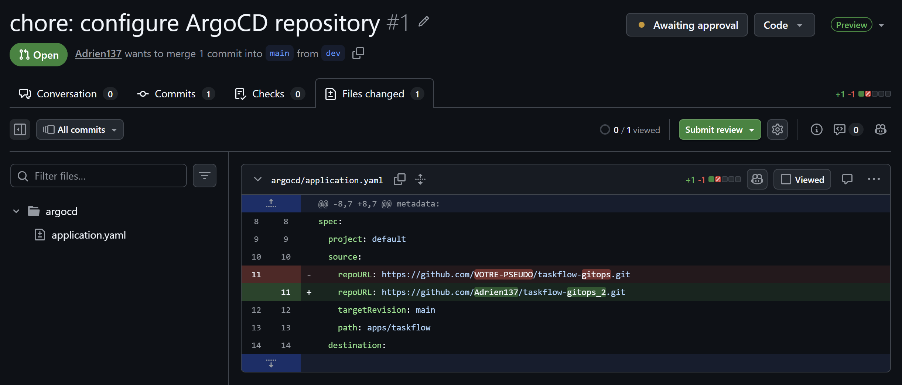

Pod kube running : 

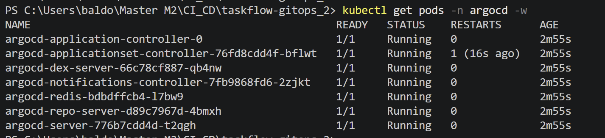

Push de mon code depuis la branch dev (vérifier le fonctionnement ) pour ensuite crée une pull request vers main: 

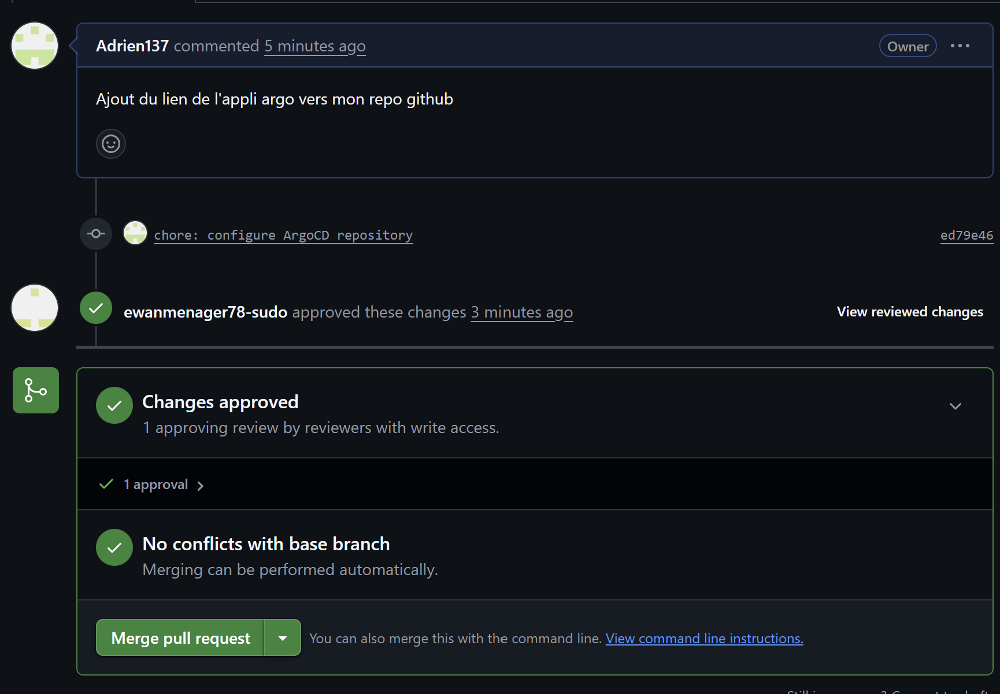

Synced + Health :

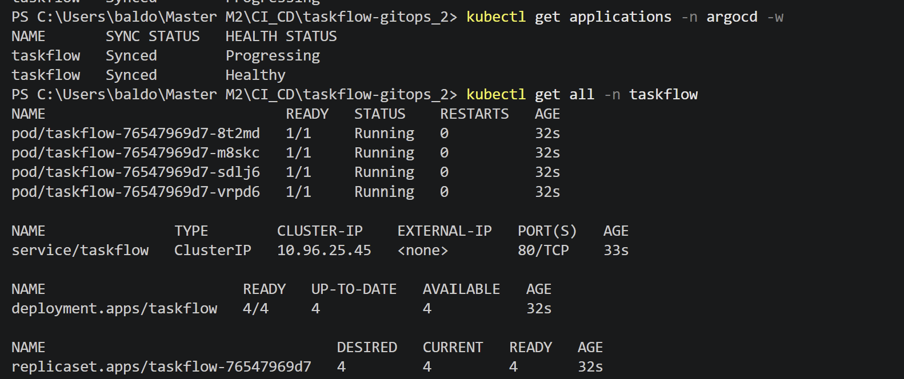

Vérification du fonctionnement grâce au script Observe.sh depuis Git bash :

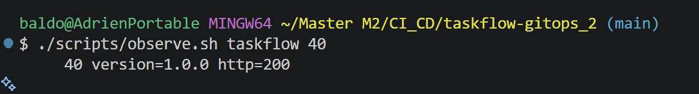

L'image a bien été changé automatiquement par argocd ( les pod con crée et terminer pour les remplacer par les nouveau ) :

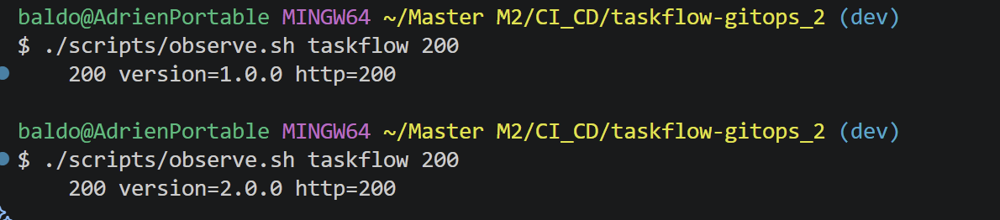
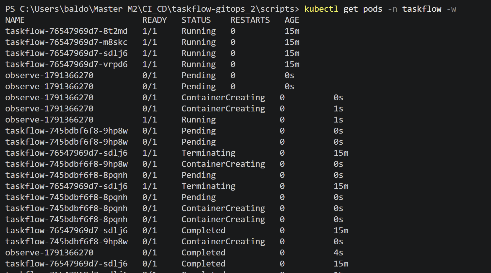

Replicas du nombre de 4 :

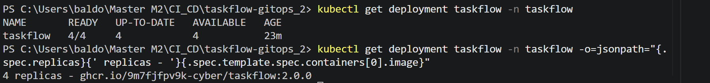

Dérive sur le nombre de replicas :

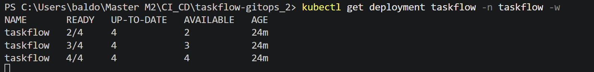

Changement de la version de l'image valide puis detection automatique de ArgoCD qui remet sous la bonne version ( verification du health status) :

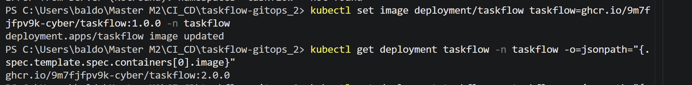
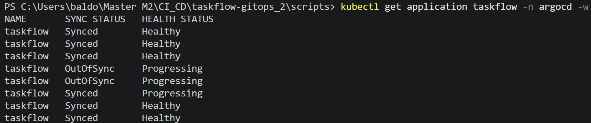

Revert de l'upgrade de version et verification du revert de l'image :

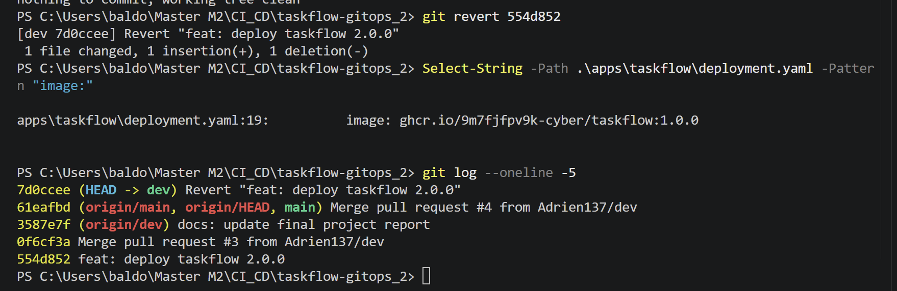

Argo cd à procéder au rollback en prenant en compte notre revert :

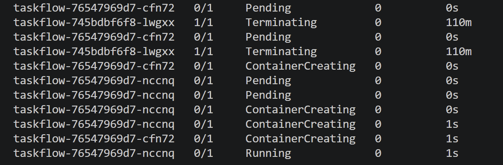

verification du changement de l'image et de l'etat des taskflow:

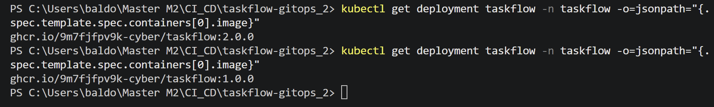
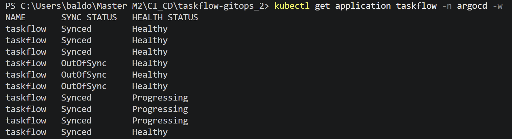
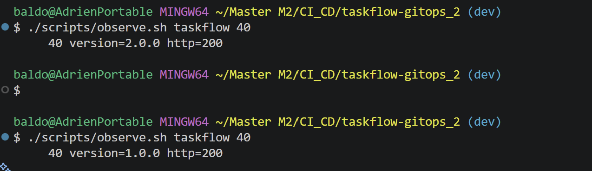


# Rendu TP Blue-Green — TaskFlow 1.0.0 → 1.1.0

Le Deployment classique a été remplacé par un Rollout Blue-Green avec deux services :
- taskflow → version active en production
- taskflow-preview → nouvelle version à tester

Remplacement du fichier deployment par rollout : 
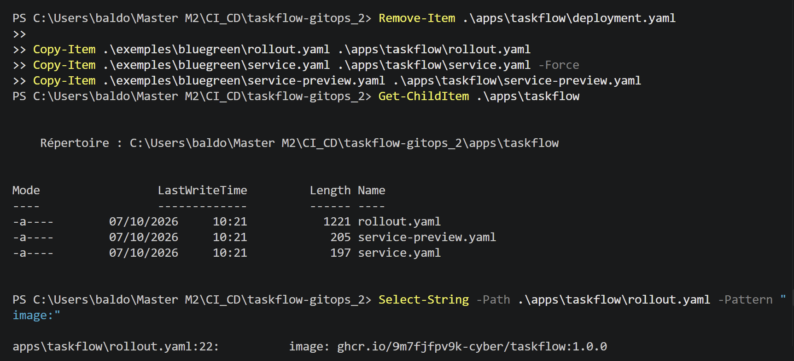

Comme on peut le voir dans cette capture, notre fichier rollout et bien reconue et l'ancien ( deployment) n'existe plus du tout :
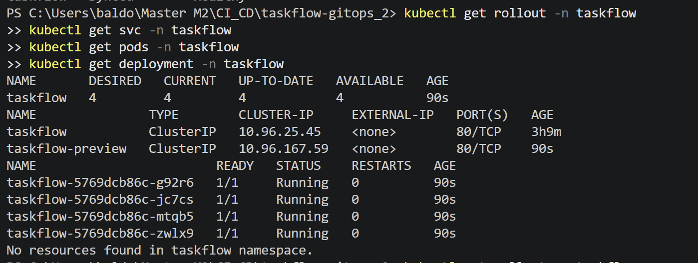


Après le déploiement de la 1.1.0, les deux versions fonctionnaient en parallèle :
taskflow          → 1.0.0 → 4 pods
taskflow-preview  → 1.1.0 → 4 pods

Vérification avec :
./scripts/observe.sh taskflow 40
./scripts/observe.sh taskflow-preview 40

Résultat :
taskflow         → version=1.0.0 http=200
taskflow-preview → version=1.1.0 http=200

CAPTURE : 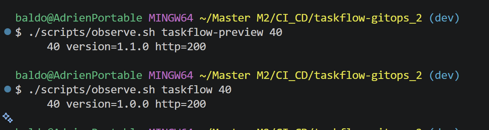

Voici ce qu'il se passe lors de l'observation après le promote du taskflow rollout : 
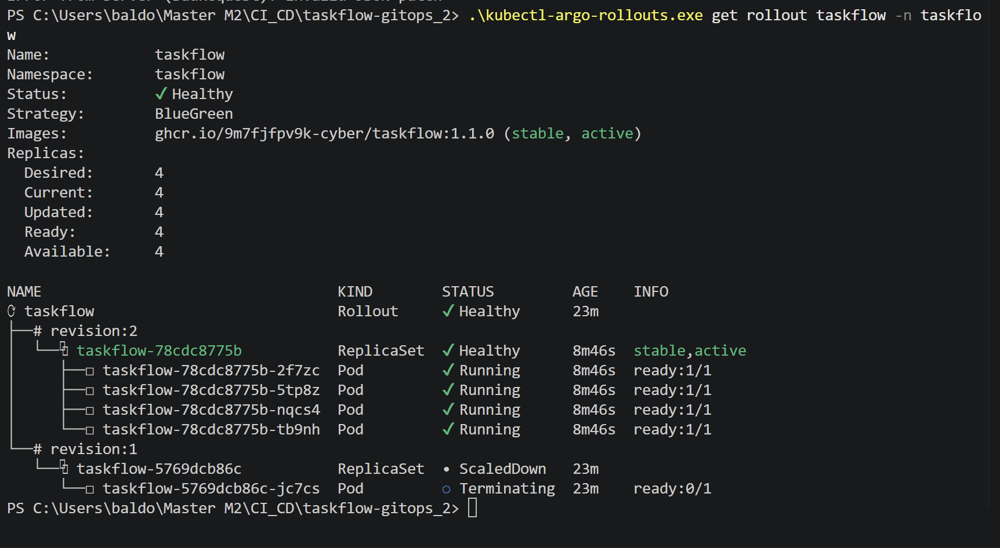
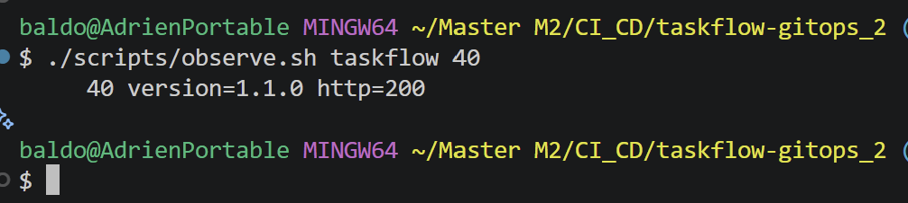

Problèmes rencontrés et corrections

La commande de promotion ne fonctionnait pas pour moi,

La commande :
kubectl argo rollouts promote taskflow -n taskflow

retournait :
error: unknown command "argo" for "kubectl"

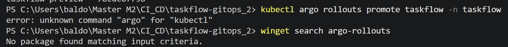

Le contrôleur Argo Rollouts était installé dans Kubernetes, mais pas le CLI Argo Rollouts sur Windows.

J'ai donc installé le CLI puis utilisé :
.\kubectl-argo-rollouts.exe promote taskflow -n taskflow

Résultat :
rollout 'taskflow' promoted

CAPTURE : 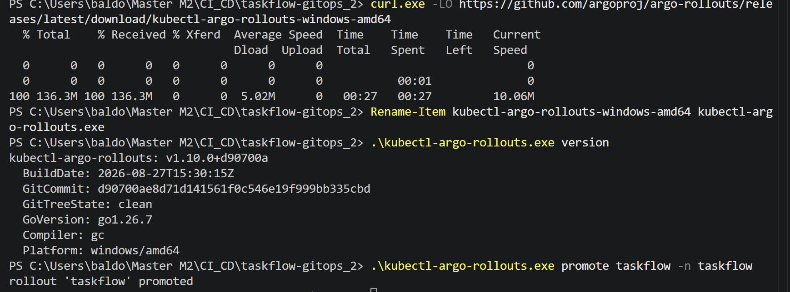

Résultat final
Après promotion :

1.1.0 → stable, active → 4 pods
1.0.0 → ScaledDown

Le Rollout est passé en :
Status:   Healthy
Strategy: BlueGreen
Image:    taskflow:1.1.0 (stable, active)

CAPTURE : 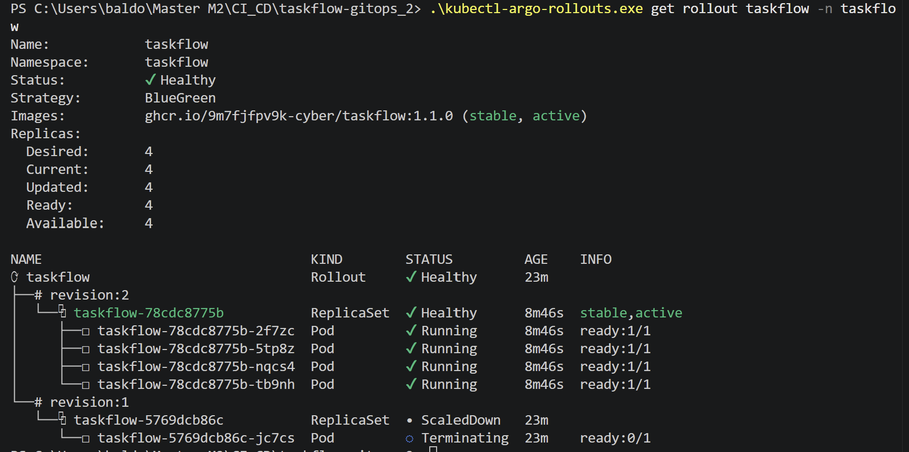

Conclusion

Le Blue-Green a permis de tester la 1.1.0 sans impacter la 1.0.0 en production, puis de basculer vers la nouvelle version après validation.

L'avantage principal est la réduction du risque lors du déploiement. En revanche, pendant la phase de test, 8 pods étaient nécessaires au lieu de 4, ce qui augmente temporairement la consommation de ressources.


# Rendu TP CANARY - TaskFlow 1.1.0

Fonctionnement de canary en remplacent les ancien fichiers rollout par ceux de canary et regarder les changement de version en direct sur le taskflows :

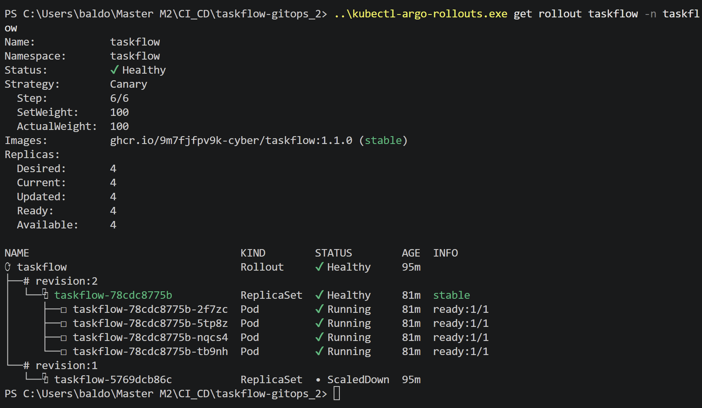

On modifie la version de l'image utilisé par le taskflow : 

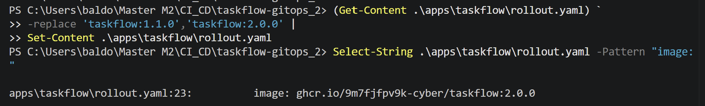

Lorsqu'on utilise le script d'observe.sh voici ce qu nous voyons : 

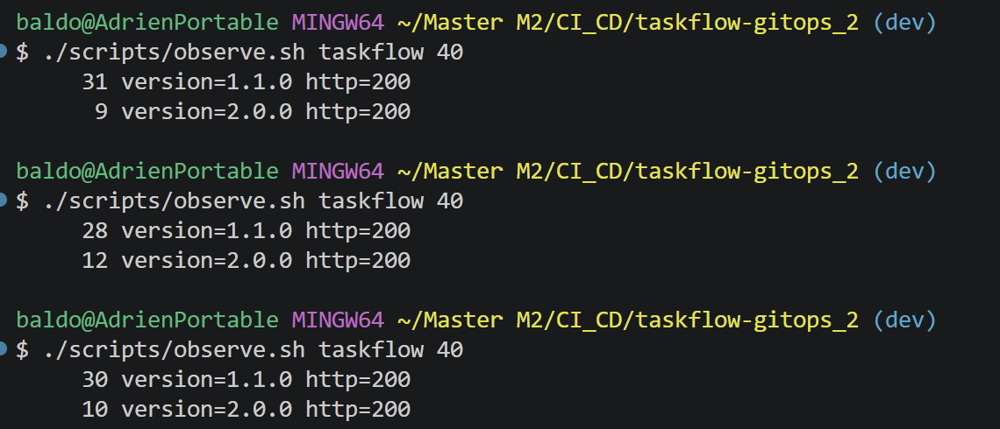

Cela prouve que nos 2 version on et sont bien pris en compte.

Ensuite, lorsque qu'on a promote notre taskflow, on peut voir que le taskflow va prendre plus de pod au lieu de se limiter a 1 seul, il commence a récupérer les autre, jusqu'a tout récupérer a 100% : 

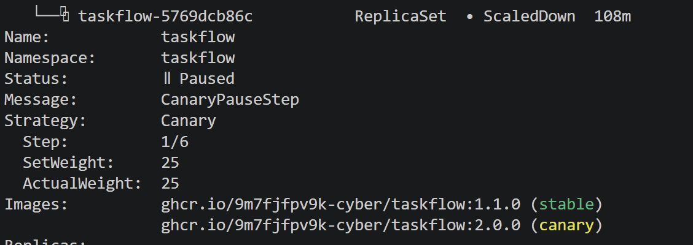
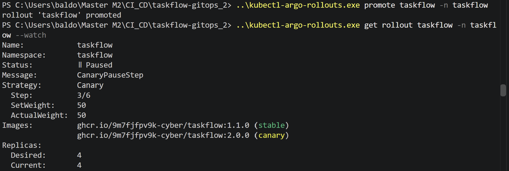
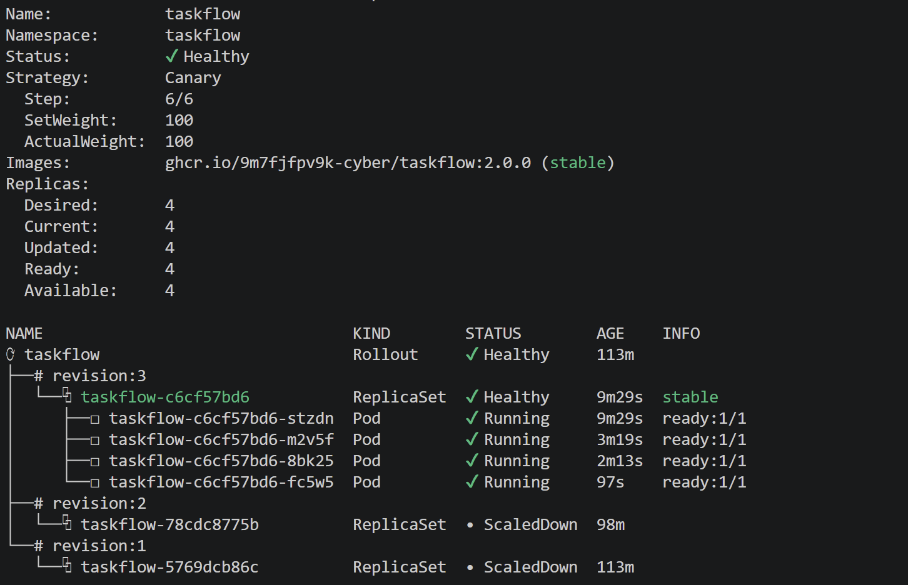

Cela prouve qu'il a pris la prio sur l'ancienne version