# taskflow-gitops — dépôt GitOps du cours CI/CD M2

Ce dépôt décrit **l'état voulu** de l'application TaskFlow dans Kubernetes.
Argo CD le surveille et aligne le cluster dessus : pour changer la production,
on ne tape pas de commande, on fait une **Pull Request**.

## Installation (à faire chez vous, avant le cours)

Prérequis : Docker Desktop démarré, 8 Go de RAM, 10 Go de disque libre.
Sous Windows : WSL2 (Ubuntu) + intégration WSL de Docker Desktop, et toutes les commandes dans WSL.

```bash
git clone https://github.com/9m7fjfpv9k-cyber/taskflow-gitops.git
cd taskflow-gitops
./scripts/install.sh
```

Le script crée un cluster local `kind`, installe Argo CD et Argo Rollouts,
puis télécharge les images des labs. Comptez 5 à 15 minutes.
Il peut être relancé sans risque.

## Structure

| Chemin | Rôle |
| --- | --- |
| `apps/taskflow/` | Les manifests surveillés par Argo CD |
| `argocd/application.yaml` | Déclare l'application dans Argo CD |
| `exemples/bluegreen/` | Manifests pour le déploiement Blue-Green |
| `exemples/canary/` | Manifests pour le déploiement Canary |
| `scripts/install.sh` | Installation de l'environnement |
| `scripts/argocd-ui.sh` | Ouvre l'interface d'Argo CD |
| `scripts/observe.sh` | Montre quelle version répond, et avec quel code HTTP |

## Images disponibles

`ghcr.io/9m7fjfpv9k-cyber/taskflow` en versions `1.0.0`, `1.1.0`, `2.0.0` et `2.1.0`.

## Équipe

- Adrien

- Ewan

## Rendu : 

Ajout du repo github a l'application ArgoCD :


Pod kube running : 


Push de mon code depuis la branch dev (vérifier le fonctionnement ) pour ensuite crée une pull request vers main: 


Synced + Health :


Vérification du fonctionnement grâce au script Observe.sh depuis Git bash :


L'image a bien été changé automatiquement par argocd ( les pod con crée et terminer pour les remplacer par les nouveau ) :


Replicas du nombre de 4 :


Dérive sur le nombre de replicas :


Changement de la version de l'image valide puis detection automatique de ArgoCD qui remet sous la bonne version ( verification du health status) :


Revert de l'upgrade de version et verification du revert de l'image :


Argo cd à procéder au rollback en prenant en compte notre revert :


verification du changement de l'image et de l'etat des taskflow:


# Rendu TP Blue-Green — TaskFlow 1.0.0 → 1.1.0

Le Deployment classique a été remplacé par un Rollout Blue-Green avec deux services :
- taskflow → version active en production
- taskflow-preview → nouvelle version à tester

Remplacement du fichier deployment par rollout : 


Comme on peut le voir dans cette capture, notre fichier rollout et bien reconue et l'ancien ( deployment) n'existe plus du tout :


Après le déploiement de la 1.1.0, les deux versions fonctionnaient en parallèle :
taskflow          → 1.0.0 → 4 pods
taskflow-preview  → 1.1.0 → 4 pods

Vérification avec :
./scripts/observe.sh taskflow 40
./scripts/observe.sh taskflow-preview 40

Résultat :
taskflow         → version=1.0.0 http=200
taskflow-preview → version=1.1.0 http=200

CAPTURE : 

Voici ce qu'il se passe lors de l'observation après le promote du taskflow rollout : 


Problèmes rencontrés et corrections

La commande de promotion ne fonctionnait pas pour moi,

La commande :
kubectl argo rollouts promote taskflow -n taskflow

retournait :
error: unknown command "argo" for "kubectl"


Le contrôleur Argo Rollouts était installé dans Kubernetes, mais pas le CLI Argo Rollouts sur Windows.

J'ai donc installé le CLI puis utilisé :
.\kubectl-argo-rollouts.exe promote taskflow -n taskflow

Résultat :
rollout 'taskflow' promoted

CAPTURE : 

Résultat final
Après promotion :

1.1.0 → stable, active → 4 pods
1.0.0 → ScaledDown

Le Rollout est passé en :
Status:   Healthy
Strategy: BlueGreen
Image:    taskflow:1.1.0 (stable, active)

CAPTURE : 

Conclusion

Le Blue-Green a permis de tester la 1.1.0 sans impacter la 1.0.0 en production, puis de basculer vers la nouvelle version après validation.

L'avantage principal est la réduction du risque lors du déploiement. En revanche, pendant la phase de test, 8 pods étaient nécessaires au lieu de 4, ce qui augmente temporairement la consommation de ressources mais egalement le coût est par conséquent doublé.


# Rendu TP CANARY - TaskFlow 1.1.0

Fonctionnement de canary en remplacent les ancien fichiers rollout par ceux de canary et regarder les changement de version en direct sur le taskflows :


On modifie la version de l'image utilisé par le taskflow : 


Lorsqu'on utilise le script d'observe.sh voici ce qu nous voyons : 


Cela prouve que nos 2 version on et sont bien pris en compte.

Ensuite, lorsque qu'on a promote notre taskflow, on peut voir que le taskflow va prendre plus de pod au lieu de se limiter a 1 seul, il commence a récupérer les autre, jusqu'a tout récupérer a 100% : 


Cela prouve qu'il a pris la place de la version stable et que l'ancienne version n'est plus disponible, en observant cela nous pouvons facilement en conclure que l'utilisation de Canary est moins coûteuse que Bluegreen, rien n'est doublé, les états précédents sont progressivement écrasés, par contre le temps est bien plus long.

# Rendu ABORT AUTOMATIQUE ET ANALYSISRUN

## Tests de charge et validation du Canary avec k6

### 1. Vérification de la charge sur TaskFlow

Nous avons exécuté le script `charge.sh` afin de générer du trafic sur TaskFlow et d'observer le comportement de l'application.

Pendant le test, nous avons également surveillé les pods Kubernetes afin de visualiser leur création et leur suppression lors des opérations de déploiement.

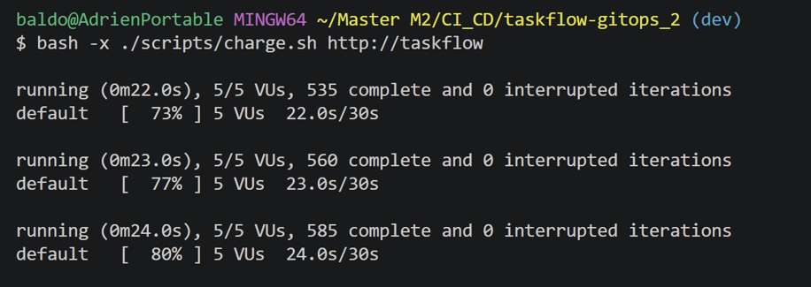

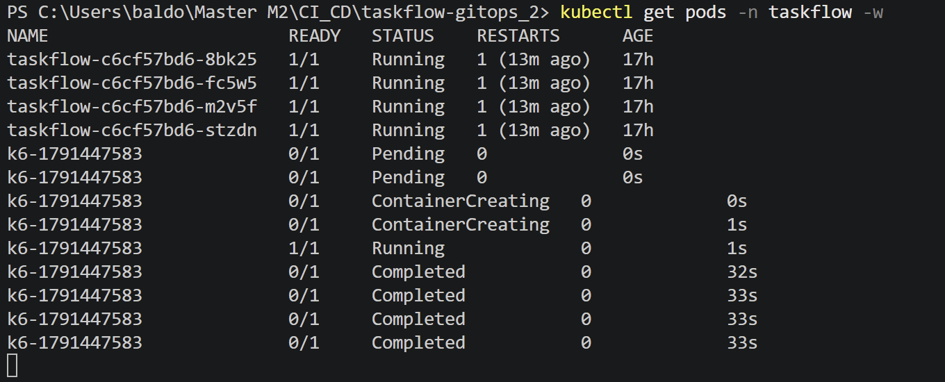

Les premiers résultats k6 sont satisfaisants :

- **Latence p95 :** 6,56 ms.
- **Erreurs HTTP :** 0 %.
- **Seuils k6 :** tous respectés.

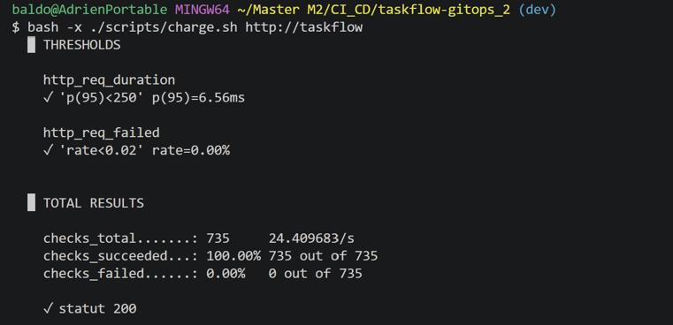

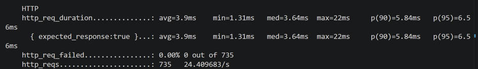

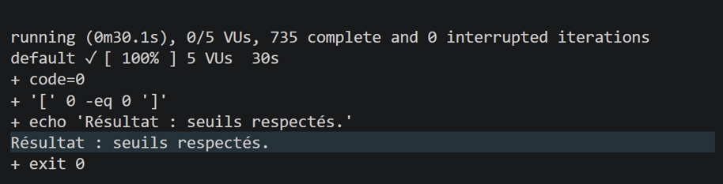

### 2. Déploiement de la version 2.1.0

Nous avons ensuite modifié l'image Docker dans `rollout.yaml` afin de passer de la version `2.0.0` à `2.1.0`.

Après synchronisation par Argo CD, le déploiement Canary s'est terminé avec succès.

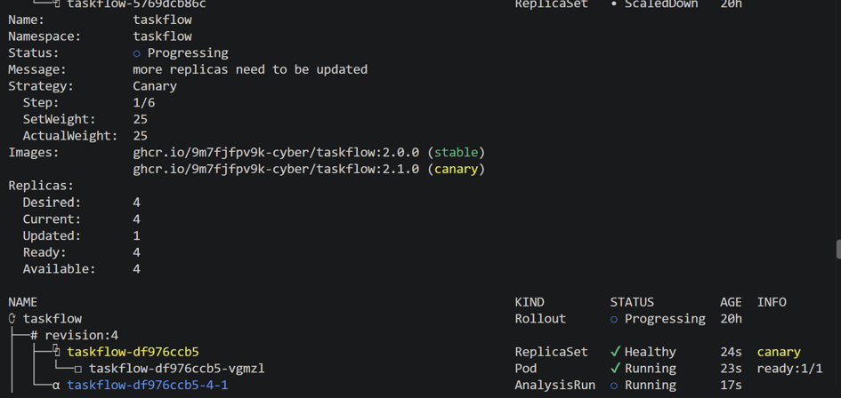

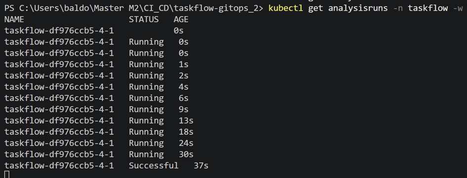

L'AnalysisRun automatique a retourné le statut `Successful`, avec 0 % d'erreurs HTTP et une latence p95 de 7,82 ms.

Ce résultat était surprenant, car la version 2.1.0 devait présenter des problèmes de performance.

### 3. Identification du problème avec k6

Pour vérifier le comportement réel de la version 2.1.0, nous avons lancé manuellement :

```bash
./scripts/charge.sh http://taskflow-canary
```

Cette fois, les résultats montrent que l'application ne respecte pas les seuils :

| Indicateur | Seuil attendu | Résultat |
|---|---|---|
| Erreurs HTTP | Moins de 2 % | 28 % |
| Latence p95 | Moins de 250 ms | 306,89 ms |

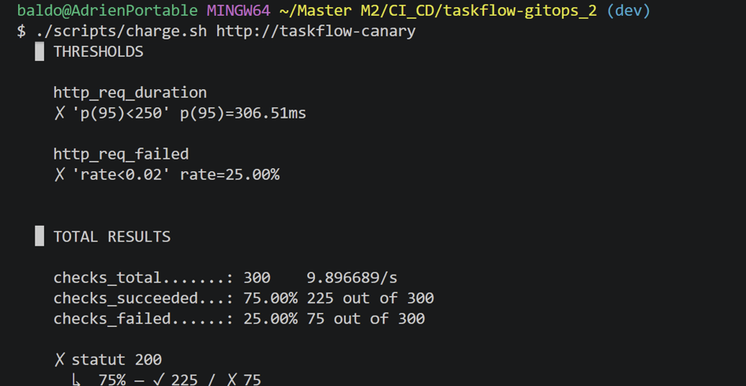

La version 2.1.0 présente donc une dégradation importante, qui n'avait pas été détectée lors du premier AnalysisRun.

### 4. Modification de la configuration k6

Nous avons modifié `apps/taskflow/configmap-k6.yaml` pour ajouter `abortOnFail: true` aux seuils de performance.

```javascript
thresholds: {
  http_req_failed: [
    { threshold: 'rate<0.02', abortOnFail: true, delayAbortEval: '5s' }
  ],
  http_req_duration: [
    { threshold: 'p(95)<250', abortOnFail: true, delayAbortEval: '5s' }
  ],
},
```

Cette option permet à k6 d'interrompre son test plus rapidement lorsqu'un seuil échoue.

Après avoir fusionné les modifications de `dev` vers `main`, Argo CD a synchronisé la nouvelle configuration.

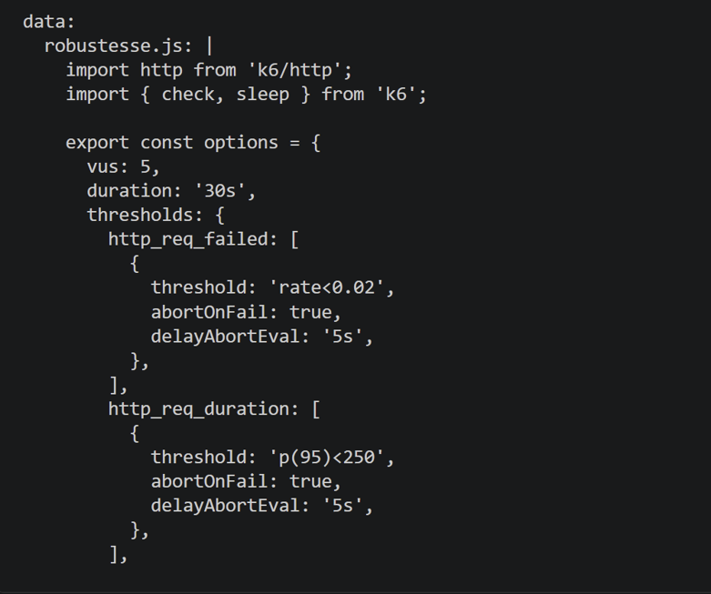

### 5. Validation de l'abandon automatique

Lors d'une nouvelle tentative de déploiement, k6 a détecté des dépassements de seuils :

- **32 % d'erreurs HTTP**.
- **307,18 ms de latence p95**.
- **AnalysisRun :** `Failed`.

Argo Rollouts a alors automatiquement interrompu le déploiement :

```text
Status: Degraded
Message: RolloutAborted
```

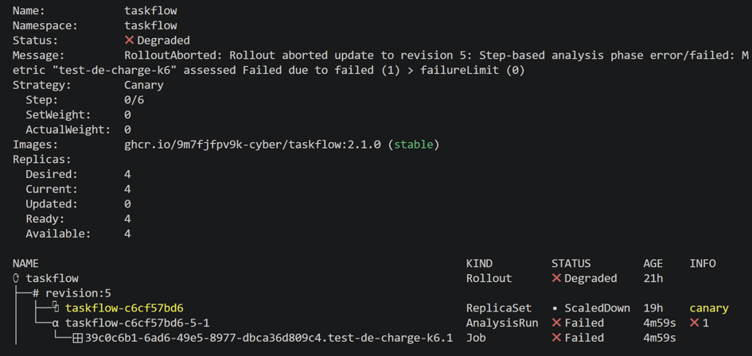

Cette capture confirme que le mécanisme d'abandon automatique fonctionne.

Cependant, cet échec concernait une tentative de retour à `2.0.0`, tandis que `2.1.0` était encore la version stable.

### Conclusion

Ces tests ont permis de vérifier le fonctionnement de k6 et son intégration avec Argo Rollouts. Les dépassements de seuils peuvent entraîner un `AnalysisRun Failed`, puis un abandon automatique du déploiement.

Cette approche permet de détecter les régressions de performance avant de généraliser une nouvelle version de l'application.


# TP 4 – Mise en place des Quality Gates de la mini-PSSI

## 1. Objectif du TP

L'objectif de ce TP est de mettre en place des contrôles de sécurité automatisés dans notre pipeline CI/CD GitHub Actions, afin de vérifier la conformité des manifestes Kubernetes et des images Docker avant leur intégration dans la branche `main`.

Pour cela, nous utilisons deux outils :

- **Conftest** : vérification des manifestes Kubernetes à partir de règles de sécurité écrites en Rego.
- **Trivy** : analyse des images Docker afin de détecter les vulnérabilités de sévérité HIGH et CRITICAL.

Ces contrôles sont intégrés dans un workflow GitHub Actions et rendus obligatoires à l'aide d'un Ruleset GitHub.

## 2. Installation de Conftest et validation des règles R3 et R4

Après avoir installé Conftest, nous avons complété les règles R3 et R4 dans le fichier `policies/kubernetes.rego`.

Nous avons ensuite exécuté la commande suivante :

```bash
conftest test apps/ --policy policies/
```

Lors de cette première exécution, Conftest a détecté une non-conformité liée à la règle **PSSI-R4**.

Cette règle impose que les conteneurs Kubernetes soient configurés pour ne pas s'exécuter en tant qu'utilisateur root.

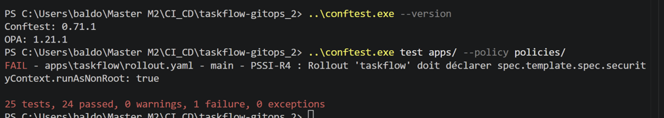

### Correction de la non-conformité

Pour respecter cette règle, nous avons modifié le fichier `apps/taskflow/rollout.yaml` en ajoutant le paramètre suivant au niveau de `spec.template.spec` :

```yaml
securityContext:
  runAsNonRoot: true
```

Cette configuration impose l'exécution du conteneur avec un utilisateur non-root.

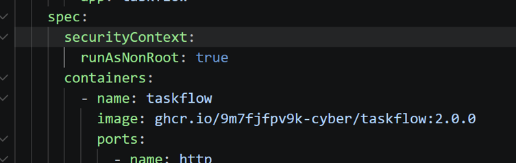

### Nouvelle validation Conftest

Après cette modification, nous avons relancé la commande :

```bash
conftest test apps/ --policy policies/
```

Cette fois, les tests ont été validés avec succès :

**25 tests exécutés, 25 réussis et 0 échec.**

Cela confirme que nos manifestes respectent désormais les règles définies dans notre politique Rego.

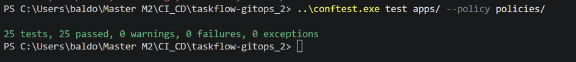

## 3. Intégration des contrôles dans GitHub Actions

Une fois les manifestes corrigés, nous avons intégré le workflow PSSI dans le fichier :

`.github/workflows/pssi.yml`

Ce workflow contient deux jobs :

- **PSSI manifests (conftest)** : vérifie les manifestes Kubernetes avec les règles Rego R1 à R4.
- **PSSI images (Trivy)** : analyse les images Docker TaskFlow pour identifier les vulnérabilités HIGH et CRITICAL.

Nous avons ensuite envoyé nos modifications sur notre branche secondaire `dev`, puis créé une Pull Request vers `main`.

```bash
git add .
git commit -m "feat: add PSSI quality gates"
git push origin dev
```

### Configuration du Ruleset GitHub

Nous avons configuré un Ruleset sur la branche `main` afin de rendre les deux jobs obligatoires avant toute fusion.

Lors de notre première Pull Request, nous avons constaté que le contrôle Trivy signalait des vulnérabilités. La fusion était donc bloquée.

Cela nous a également permis de vérifier que les contrôles obligatoires configurés dans le Ruleset étaient bien pris en compte.

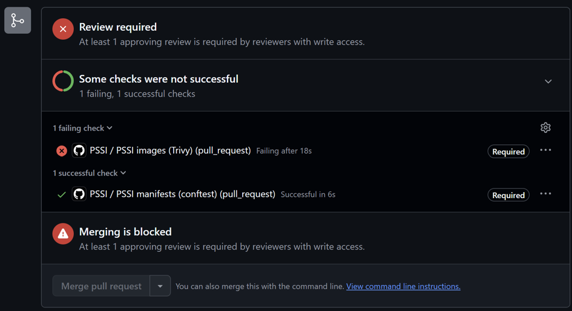

## 4. Vérification des règles R1 et R2 avec une image non conforme

Afin de vérifier que notre politique de sécurité bloque correctement les images non autorisées, nous avons volontairement modifié l'image utilisée dans notre Rollout Kubernetes.

Nous avons remplacé l'image initiale par :

```yaml
image: nginx:latest
```

Cette modification permet de tester deux règles :

- **PSSI-R1** : interdiction de l'utilisation du tag `latest`.
- **PSSI-R2** : interdiction des images provenant d'un registre non autorisé.

Nous avons ensuite relancé Conftest.

### Résultat du test

Le contrôle a détecté les deux non-conformités :

- R1 : utilisation du tag `latest`.
- R2 : utilisation d'une image ne provenant pas du registre autorisé.

Le résultat était de **23 tests réussis et 2 tests échoués**.

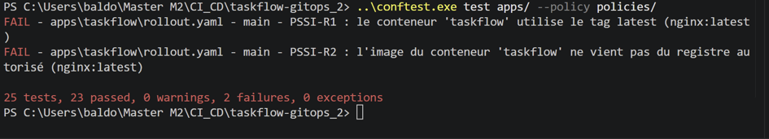

Nous avons ensuite envoyé cette modification sur la branche `dev` pour observer le comportement de GitHub Actions.

Dans notre Pull Request, le job **PSSI manifests (conftest)** est passé en échec, empêchant la fusion vers `main`.

Les logs GitHub Actions indiquaient bien que le blocage provenait des règles R1 et R2.

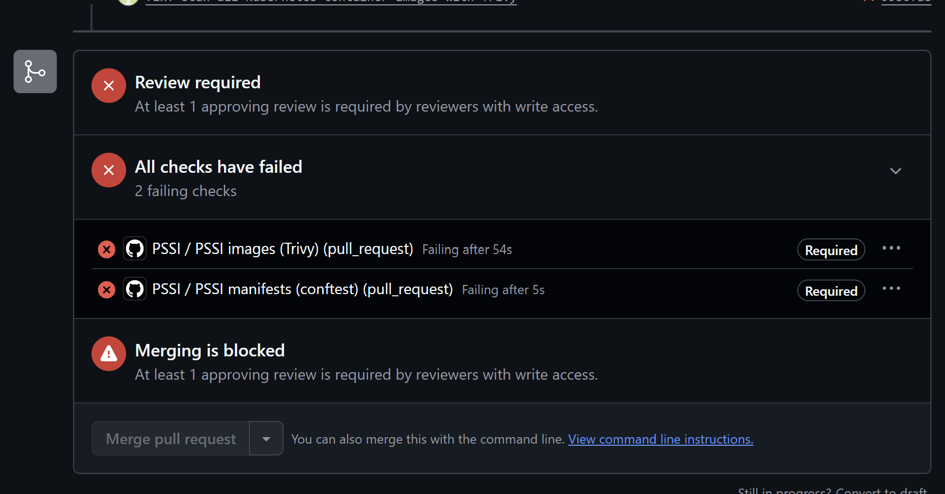

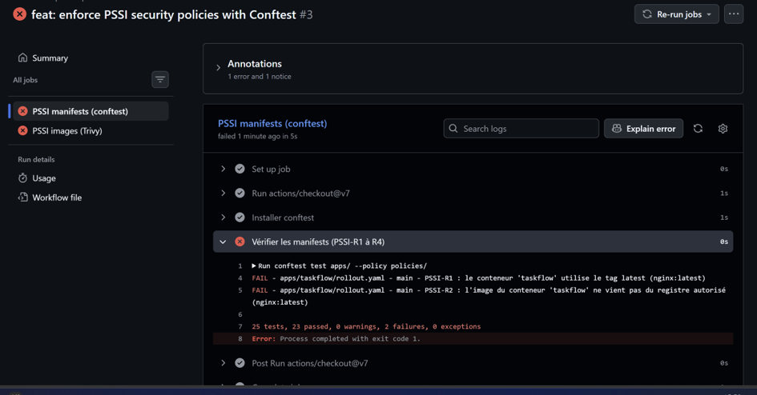

Ce test confirme que notre Quality Gate est capable d'empêcher l'intégration d'une configuration Kubernetes non conforme.

## 5. Correction du Rollout et gestion des vulnérabilités Trivy

Après avoir vérifié le fonctionnement des règles R1 et R2, nous avons réalisé deux opérations :

1. Restaurer l'image Docker conforme dans notre Rollout.
2. Créer un fichier `.trivyignore` pour documenter les exceptions temporaires aux vulnérabilités détectées.

### Restauration de l'image conforme

Nous avons remis l'image initiale dans le fichier `apps/taskflow/rollout.yaml` :

```yaml
image: ghcr.io/9m7fjfpv9k-cyber/taskflow:2.0.0
```

Cette image respecte les règles R1 et R2 puisqu'elle utilise un tag versionné et provient du registre autorisé.

### Création du fichier .trivyignore

Le scan Trivy avait détecté plusieurs vulnérabilités de sévérité HIGH dans les images analysées.

Dans le cadre du TP, nous avons choisi de documenter des exceptions temporaires plutôt que de modifier immédiatement les images et leurs dépendances.

Nous avons donc créé un fichier `.trivyignore` à la racine du dépôt.

Ce fichier contient les identifiants CVE à exclure temporairement du contrôle, accompagnés d'une justification et d'une date de réévaluation.

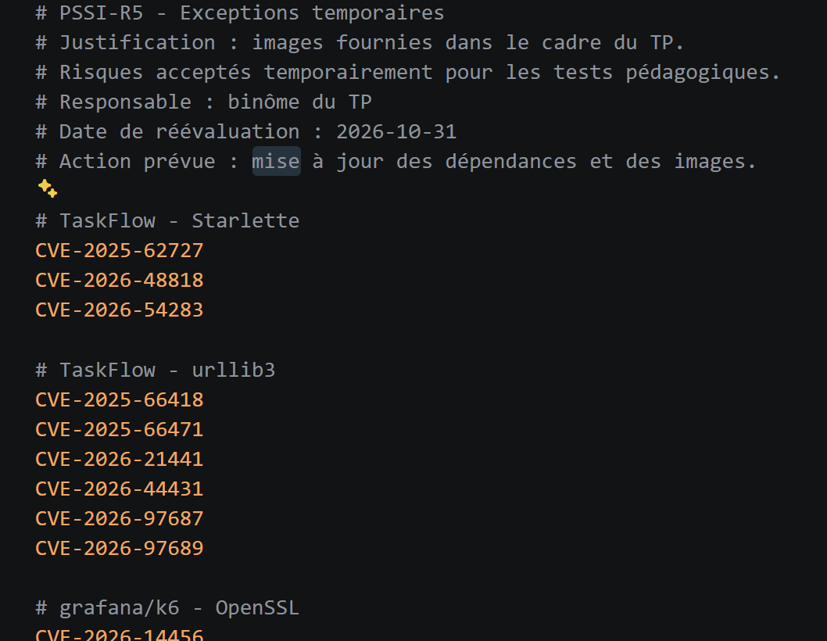

Les exceptions couvrent les **10 identifiants CVE distincts** relevés dans nos derniers logs.

Il est important de préciser que ces exceptions ne corrigent pas les vulnérabilités : elles permettent uniquement de les exclure temporairement du résultat bloquant de Trivy.

Ces vulnérabilités devront être réévaluées et corrigées ultérieurement, notamment par la mise à jour des dépendances et des images concernées.

## 6. Validation finale des Quality Gates

Après avoir restauré l'image conforme et ajouté le fichier `.trivyignore`, nous avons envoyé les modifications sur la branche `dev`.

Nous avons ensuite consulté notre Pull Request vers `main`.

Cette fois, les deux jobs obligatoires ont été exécutés avec succès :

- **PSSI images (Trivy)** : Successful, en 23 secondes.
- **PSSI manifests (conftest)** : Successful, en 7 secondes.

Les deux contrôles apparaissent également avec le statut **Required**, ce qui confirme leur intégration dans le Ruleset GitHub.

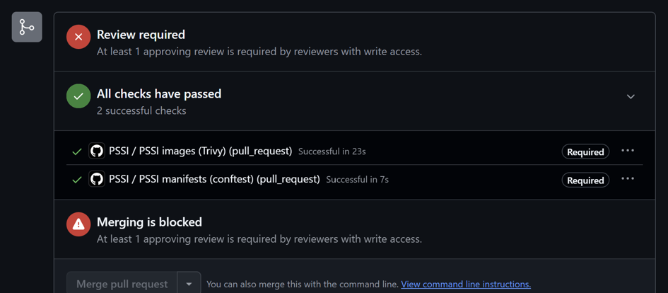

La fusion reste néanmoins bloquée tant qu'un collaborateur disposant des droits nécessaires n'a pas approuvé la Pull Request.

Cette protection supplémentaire permet d'imposer une validation humaine en complément des contrôles automatisés.

## 7. Tableau récapitulatif des règles de sécurité

| Règle | Contrôle de sécurité | Outil | Preuve de validation |
|---|---|---|---|
| PSSI-R1 | Interdire les images utilisant le tag `latest` | Conftest / Rego | Échec du test avec `nginx:latest` |
| PSSI-R2 | Autoriser uniquement les registres d'images définis dans la politique | Conftest / Rego | Blocage de l'image `nginx:latest` |
| PSSI-R3 | Contrôle de conformité défini dans `kubernetes.rego` | Conftest / Rego | Validation lors des 25 tests réussis |
| PSSI-R4 | Imposer `runAsNonRoot: true` dans le Rollout | Conftest / Rego | Échec initial, correction, puis validation |
| PSSI-R5 | Détecter les vulnérabilités HIGH et CRITICAL des images analysées | Trivy | Scan GitHub Actions réussi avec exceptions documentées |

## 8. Conclusion

Ce TP nous a permis de mettre en place une politique de sécurité automatisée dans notre processus GitOps.

Grâce à Conftest et aux règles Rego, nous avons pu détecter et corriger des configurations Kubernetes non conformes, notamment l'absence du paramètre `runAsNonRoot` et l'utilisation d'une image avec le tag `latest`.

L'intégration de Trivy nous a également permis de contrôler les vulnérabilités des images Docker et de mettre en place une gestion documentée des exceptions temporaires.

Enfin, la configuration du Ruleset GitHub garantit que les contrôles de sécurité doivent réussir avant toute fusion vers `main`, avec une approbation humaine supplémentaire.

**Nous avons ainsi mis en place des Quality Gates fonctionnels permettant de renforcer la sécurité de notre pipeline CI/CD et de limiter l'introduction de configurations non conformes dans notre environnement Kubernetes.**